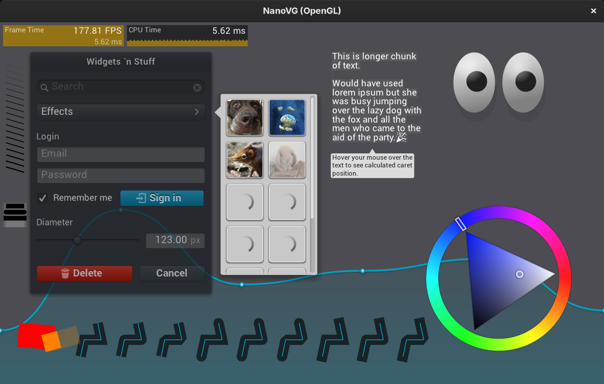

NanoVG
======

NanoVG is a small antialiased vector graphics rendering library with a lean API modeled after the HTML5 canvas API. It is aimed to be a practical and fun toolset for building scalable user interfaces and visualizations.



## Fork

This is a fork of the original [NanoVG](https://github.com/memononen/nanovg) by [Mikko Mononen](https://github.com/memononen), which is no longer actively maintained.

The goals of this fork are:
- Keep the library alive and usable with modern toolchains
- Replace the legacy OpenGL backend with a [Sokol](https://github.com/floooh/sokol) backend for better portability
- Update dependencies (stb_image, stb_truetype)
- Maintain a simple, easy-to-build codebase

The original OpenGL backends are preserved in the `obsolete/` folder for reference.

## Usage

The NanoVG API is modeled loosely on the HTML5 canvas API. If you know canvas, you're up to speed with NanoVG in no time.

### Creating a Drawing Context

The drawing context is created using a backend-specific constructor function. Using the Sokol backend:

```c
#define SOKOL_NANOVG_IMPL
#include "sokol_nanovg.h"
...
struct NVGcontext* vg = snvg_create(NVG_ANTIALIAS | NVG_STENCIL_STROKES);
```

The first parameter defines flags for creating the renderer:

- `NVG_ANTIALIAS` means that the renderer adjusts the geometry to include anti-aliasing. If you're using MSAA, you can omit this flag.
- `NVG_STENCIL_STROKES` means that the renderer uses better quality rendering for (overlapping) strokes. The quality is mostly visible on wider strokes. If you want speed, you can omit this flag.

**Note:** The render target you're rendering to must have a stencil buffer.

### Drawing Shapes

Drawing a simple shape using NanoVG consists of four steps: 1) begin a new shape, 2) define the path to draw, 3) set fill or stroke, 4) and finally fill or stroke the path.

```c
nvgBeginPath(vg);
nvgRect(vg, 100, 100, 120, 30);
nvgFillColor(vg, nvgRGBA(255, 192, 0, 255));
nvgFill(vg);
```

Calling `nvgBeginPath()` will clear any existing paths and start drawing from a blank slate. There are a number of functions to define the path to draw, such as rectangle, rounded rectangle, and ellipse, or you can use the common moveTo, lineTo, bezierTo, and arcTo API to compose paths step by step.

### Understanding Composite Paths

Because of the way the rendering backend is built in NanoVG, drawing a composite path, that is a path consisting of multiple paths defining holes and fills, is a bit more involved. NanoVG uses the even-odd filling rule and by default, paths are wound in counter-clockwise order. Keep that in mind when drawing using the low-level draw API. In order to wind one of the predefined shapes as a hole, you should call `nvgPathWinding(vg, NVG_HOLE)`, or `nvgPathWinding(vg, NVG_CW)` _after_ defining the path.

```c
nvgBeginPath(vg);
nvgRect(vg, 100, 100, 120, 30);
nvgCircle(vg, 120, 120, 5);
nvgPathWinding(vg, NVG_HOLE);   // Mark circle as a hole.
nvgFillColor(vg, nvgRGBA(255, 192, 0, 255));
nvgFill(vg);
```

### Troubleshooting

If rendering is wrong:

- Make sure you have created a NanoVG context using `snvg_create()`
- Make sure you have initialized your graphics backend with a stencil buffer
- Make sure you have cleared the stencil buffer
- Make sure all rendering calls happen between `nvgBeginFrame()` and `nvgEndFrame()`

## Building

The project uses a simple Makefile. Currently, only Linux is supported:

```sh
make
./build/example
```

## API Reference

See the header file [nanovg.h](src/nanovg.h) for API reference.

## Other Ports

- [DX11 port](https://github.com/cmaughan/nanovg) by [Chris Maughan](https://github.com/cmaughan)
- [Metal port](https://github.com/ollix/MetalNanoVG) by [Olli Wang](https://github.com/olliwang)
- [bgfx port](https://github.com/bkaradzic/bgfx/tree/master/examples/20-nanovg) by [Branimir Karadžić](https://github.com/bkaradzic)

## License

The library is licensed under the [zlib license](LICENSE).

Fonts used in examples:
- Roboto licensed under [Apache License 2.0](http://www.apache.org/licenses/LICENSE-2.0)
- Entypo licensed under CC BY-SA 4.0
- Noto Emoji licensed under [SIL Open Font License, Version 1.1](http://scripts.sil.org/cms/scripts/page.php?site_id=nrsi&id=OFL)

## Links

Uses [stb_truetype](http://nothings.org) for font rendering.
Uses [stb_image](http://nothings.org) for image loading.
